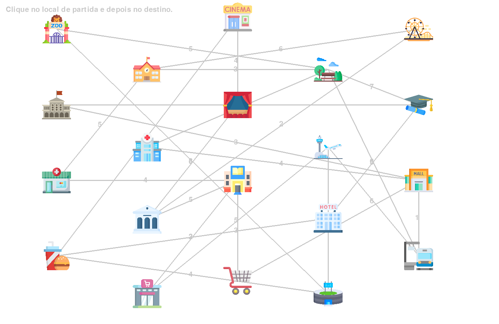

# Dijkstra Game

*Número da Lista*: 16<br>
*Conteúdo da Disciplina*: Grafos 2<br>

## Alunos
| Matrícula | Aluno |
| -- | -- |
| 22/1022570 | Gabryel Nícolas Soares de Sousa |
| 22/1037465 | Douglas Marinho Martins |

## Sobre
Este projeto consiste no desenvolvimento de um jogo interativo que implementa o algoritmo de Dijkstra para encontrar o caminho mais curto em um mapa de cidade. O objetivo do jogo é demonstrar como o algoritmo de Dijkstra funciona de maneira visual e educativa, permitindo que os jogadores escolham um ponto de partida e um destino, e então visualizem o algoritmo em ação para encontrar o caminho mais rápido entre esses pontos.

O mapa é composto por locais (como hospitais, escolas, praças, etc.) conectados por rotas, com pesos representando a distância entre eles. O jogador seleciona dois locais e o algoritmo de Dijkstra calcula o caminho mais curto. A visualização é feita por meio de animações que mostram as etapas do algoritmo.

### Funcionalidades:
- Exibição de um mapa interativo com locais e rotas.
- Escolha de pontos de partida e destino pelo jogador.
- Animação do algoritmo de Dijkstra ao encontrar o caminho mais curto.
- Interface intuitiva com menus para iniciar o jogo, ver as instruções ou sair.

### Dificuldade:
O jogo foi desenvolvido para apresentar o algoritmo de Dijkstra de forma simples, mas pode ser desafiador em níveis mais complexos de mapas, dependendo das rotas e distâncias.

## Screenshots
Aqui estão algumas imagens que mostram o jogo em funcionamento:

1. **Menu do Jogo:**
   

2. **Gameplay do Jogo:**
   

3. **Tela de Como Jogar:**
   

## Instalação
*Linguagem*: Python (Pygame)

### Dependências:
Para rodar o jogo é necessário ter o python instalado em sua maquina e as seguintes bibliotecas:
- Pygame: Biblioteca gráfica para a construção do jogo.

Para instalar as dependências, execute o seguinte comando:
```bash
pip install pygame
```

## Uso
Basta rodar o arquivo main.py para iniciar o jogo. Ao rodar o código, você verá o mapa da cidade e poderá selecionar os locais de início e fim para o algoritmo de Dijkstra calcular o caminho mais curto.

Na pasta raiz do projeto para rodar apenas use
```bash
py main.py
```

## Apresentações

As apresentações de cada entrega estão presentes nos hiperlinks a seguir:

| [1º Entrega](https://youtu.be/qyiYN-fiM3w?si=oefVVOtYeHa6r2TN) | Dijkstra Game |

---


